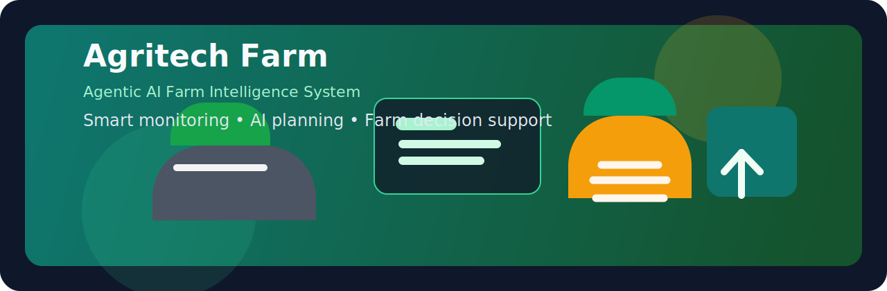

# 🌾 Agentic AI Farm Intelligence System



> Autonomous, multi-agent farm intelligence platform for crop monitoring, risk analysis, planning, and decision support.

[](https://www.python.org/downloads/)
[](https://fastapi.tiangolo.com/)
[](LICENSE)
[](https://github.com/Vansh-Thakur-Sadyal/Agritech_Farm)
[](https://github.com/Vansh-Thakur-Sadyal/Agritech_Farm)

---

## 🎯 Overview

The Agentic AI Farm Intelligence System is a smart agricultural platform that combines modern web interfaces, FastAPI services, and specialized AI agents to assist farmers and agricultural teams with real-time farm monitoring, crop recommendations, disease awareness, and automated planning.

This project is designed to turn raw field telemetry and agricultural data into practical, actionable decisions.

### What this system does
- Collects and standardizes farm-related data such as soil moisture, temperature, humidity, and crop context.
- Uses AI-driven analysis for crop recommendations and disease-focused insights.
- Orchestrates multiple specialized agents to create a complete farm decision pipeline.
- Exposes a backend API for dashboard integration and automation.
- Offers an interactive frontend experience for visualizing telemetry and running the pipeline.

---

## 🧠 Core Architecture

The system follows a modular flow:

1. Frontend dashboard collects user inputs and sends them to the backend.
2. FastAPI receives requests and routes them to the orchestrator.
3. The orchestrator runs the workflow across specialized agents.
4. Results are returned to the UI and can be used for monitoring or planning.

### High-level workflow
```text
Frontend Dashboard
        ↓
FastAPI Backend
        ↓
Agent Orchestrator
   ├─ Agent 1: Data Collection & Standardization
   ├─ Agent 2: Analysis & Risk Intelligence
   └─ Agent 3: Decision Planning
```

---

## 🤖 Agent Roles

### Agent 1: Data Collection & Standardization
Handles the ingestion of field-related inputs and prepares them for downstream analysis.

Features include:
- Sensor and environmental data handling
- Data cleaning and validation
- Standardized field records for analysis
- Storage support for processed information

### Agent 2: Analytics & Risk Intelligence
Processes farm conditions to detect risks, analyze trends, and provide insight for crop health and planning.

Features include:
- Crop and field analysis
- Disease-aware recommendations
- Rule-based and ML-assisted evaluation
- Risk scoring and monitoring insights

### Agent 3: Decision Planning
Transforms analysis results into practical strategies such as irrigation suggestions, resource planning, and recommendation actions.

Features include:
- Strategy generation
- Planning support for yield and sustainability goals
- Integration with monitoring and memory workflows

---

## ✨ Key Features

- Real-time dashboard experience for farm monitoring
- Multi-agent orchestration for agriculture workflows
- FastAPI-powered backend with REST endpoints
- Chat-style interaction for quick agricultural queries
- Crop and disease analysis support
- Workflow tracking and progress reporting
- Easy extension for future planning, forecasting, and storage integrations

---

## 🛠️ Technology Stack

### Backend
- Python
- FastAPI
- Uvicorn
- Pydantic-style request handling

### Frontend
- HTML
- CSS
- JavaScript
- Interactive dashboard UI

### AI & Data Layer
- Mistral-compatible LLM integration
- Data processing and analysis modules
- Optional support for storage and database-backed extensions

---

## 📁 Project Structure

```text
Agentic-AI-Farm-Intelligence-System-main/
├── backend/
│   ├── agents/
│   │   ├── agent1/
│   │   ├── agent2/
│   │   └── agent3/
│   ├── api/
│   └── logs/
├── frontend/
│   ├── index.html
│   ├── index.js
│   ├── index.css
│   ├── dashboard2.html
│   ├── dashboard2.js
│   └── dashboard2.css
├── README.md
├── requirements.txt
└── .gitignore
```

---

## 🚀 Getting Started

### Windows quick start
```powershell
git clone https://github.com/Vansh-Thakur-Sadyal/Agritech_Farm.git
cd Agritech_Farm
python -m venv .venv
.venv\Scripts\Activate.ps1
pip install -r requirements.txt
```

### 1. Clone the repository
```bash
git clone https://github.com/Vansh-Thakur-Sadyal/Agritech_Farm.git
cd Agritech_Farm
```

### 2. Create and activate a virtual environment
```bash
python -m venv .venv
# Windows
.venv\Scripts\activate
# macOS/Linux
source .venv/bin/activate
```

### 3. Install dependencies
```bash
pip install -r requirements.txt
```

### 4. Configure environment variables
Create a `.env` file in the project root with values such as:

```env
MISTRAL_API_KEY=your-api-key-here
```

### 5. Start the backend
```bash
cd backend
python -m uvicorn api.server:app --reload --host 0.0.0.0 --port 8001
```

### 6. Start the frontend
From the project root, open the frontend in a simple static server:

```bash
cd frontend
python -m http.server 3000
```

Then visit:
- http://localhost:3000/index.html
- http://localhost:8001/docs for FastAPI docs

---

## � Demo Preview

A simple dashboard experience is included for interacting with the system and observing the coordinated farm intelligence workflow.


You can expect to see:
- a control panel for farm inputs and field conditions
- agent-driven analysis results
- a chatbot-style interaction panel
- monitoring and planning feedback from the backend pipeline

---

## �🔌 API Endpoints

The backend exposes the following main endpoints:

- POST `/run-agent` — runs the full farm intelligence pipeline
- POST `/chat` — sends a natural-language agricultural query
- GET `/progress` — retrieves current pipeline progress information
- POST `/apply-strategy` — saves a recommended strategy into memory

Example request:
```bash
curl -X POST http://127.0.0.1:8001/run-agent \
  -H "Content-Type: application/json" \
  -d '{"query":"Analyze field conditions","agent1":{},"agent2":{},"agent3":{}}'
```

---

## 📦 Running the Dashboard

The frontend is a lightweight dashboard for interacting with the system. It lets you:
- adjust farm parameters
- trigger analysis runs
- visualize system health
- interact with the chatbot interface

The dashboard is expected to communicate with the backend at `http://127.0.0.1:8001`.

---

## 🤝 Contributing

Contributions are welcome.

1. Fork the repository
2. Create a feature branch
3. Make your changes
4. Commit and push your branch
5. Open a pull request

Please keep code clean, document new features, and add tests where appropriate.

---

## 📄 License

This project is licensed under the Apache License 2.0.

---

## 🙌 Acknowledgment

Built as an intelligent agriculture platform to support smarter crop monitoring, planning, and decision-making with the help of AI-driven workflows.
